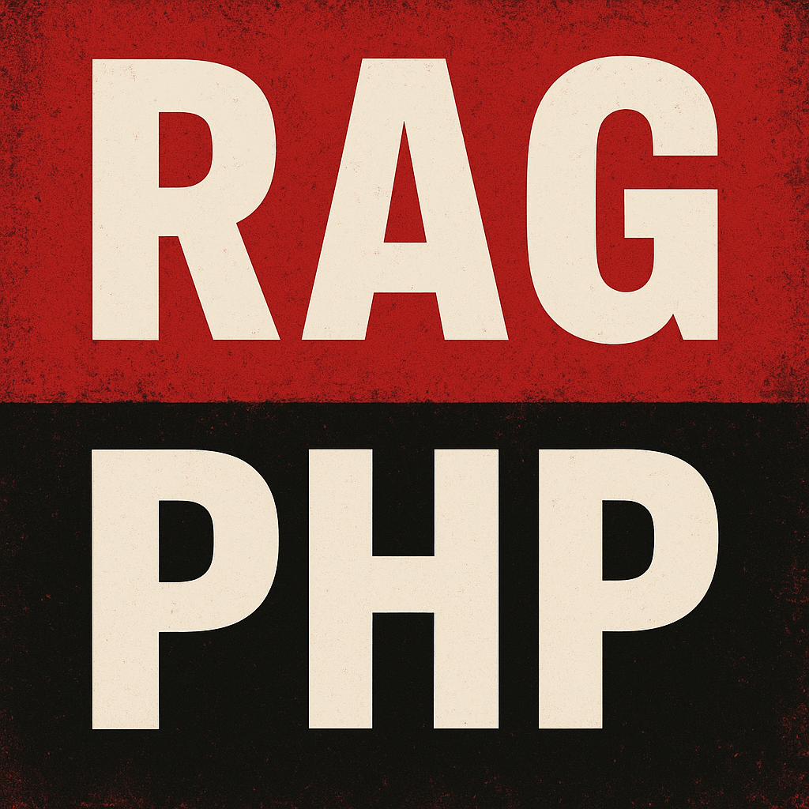

# RAG System - система поиска по документам с искусственным интеллектом



## Описание

RAG (Retrieval-Augmented Generation) System - это система поиска информации по документам с использованием искусственного интеллекта. 
Проект позволяет загружать документы различных форматов, обрабатывать их с помощью LLM, создавать векторные представления 
для семантического поиска и получать ответы на вопросы на основе загруженных документов.

## Основные возможности

- Загрузка и обработка документов (TXT, MD, HTML, PDF, DOCX, DOC)
- Генерация векторных эмбеддингов для семантического поиска
- Гибридный поиск (векторный + ключевые слова) для повышения точности
- Генерация ответов с помощью LLM на основе найденных фрагментов
- Аутентификация и авторизация пользователей
- История запросов с пагинацией
- Мониторинг статуса обработки документов

## Технологический стек

### Backend
- **PHP 8.4** - основной язык разработки
- **FrankenPHP** - сервер приложений PHP
- **Caddy** - веб-сервер для FrankenPHP
- **Nginx** - балансировщик нагрузки (production)
- **PostgreSQL** с расширением **pgvector** - база данных для хранения документов и векторов
- **Redis** - кэширование
- **RabbitMQ** - очереди задач для асинхронной обработки документов

### LLM и обработка документов
- **[llama.cpp](https://github.com/ggerganov/llama.cpp)** - LLM сервер
- **[Qwen 2.5 7B Instruct](https://huggingface.co/Qwen/Qwen2.5-7B-Instruct)** - мультиязычная языковая модель (можно использовать любую мультиязычную или русскоязычную модель)
- **Hybrid Search** - комбинация векторного поиска [косинусное подобие](https://ichi.pro/ru/ponimanie-kosinusnogo-podobia-i-ego-primenenia-278464028813674) и полнотекстового поиска [BM25](https://ru.wikipedia.org/wiki/Okapi_BM25)

### Frontend
- **HTML5, CSS3, JavaScript** - клиентское приложение

### Инфраструктура
- **Docker Compose** - контейнеризация
- **GitHub Actions** - CI/CD

## Установка и развертывание

### Требования

- 4+ CPU cores
- 8GB+ RAM (для LLM модели)
- Docker и Docker Compose
- Git

### Шаги установки

1. Клонируйте репозиторий:

```bash
git clone https://github.com/Andrey-Yurchuk/RAG.git
cd RAG
```

2. Скопируйте файл конфигурации окружения:

```bash
cp .env.example .env
```

3. Отредактируйте `.env` файл с нужными параметрами:

```env
DB_HOST=postgres
DB_PORT=5432
DB_DATABASE=rag_system
DB_USERNAME=rag_user
DB_PASSWORD=your_password

REDIS_HOST=redis
REDIS_PORT=6379
REDIS_PASSWORD=your_redis_password

RABBITMQ_HOST=rabbitmq
RABBITMQ_PORT=5672
RABBITMQ_USER=guest
RABBITMQ_PASSWORD=guest

LLAMA_CPP_URL=http://llm-service:8080
```

4. Убедитесь, что модель LLM находится в папке `models/`, скачать можно с [Hugging Face](https://huggingface.co/)


5. Запустите контейнеры:

```bash
docker-compose up -d
```

6. Выполните миграции базы данных:

```bash
php bin/migrate-host.php migrations:migrate
```

### Доступ к системе локально

- **Веб-интерфейс**: http://localhost:8080
- **Учетные данные по умолчанию**:
  - Username: `admin`
  - Password: `admin123`

После первого входа измените пароль администратора.

## Архитектура поиска

### Гибридный поиск (Hybrid Search)

Система использует комбинацию двух методов поиска:

1. **Векторный поиск** - поиск по косинусному расстоянию между эмбеддингами
2. **Полнотекстовый поиск** - поиск по ключевым словам с использованием PostgreSQL GIN индексов

Результаты объединяются с помощью [Reciprocal Rank Fusion (RRF)](https://learn.microsoft.com/ru-ru/azure/search/hybrid-search-ranking) для получения наиболее релевантных результатов.

## Разработка

### Запуск тестов

```bash
# Юнит тесты
make test-unit

# Интеграционные тесты
make test-integration
```

### PHPStan и PHPCS

```bash
# PHPStan
make analyse

# PHPCS
make check-style

# Автоматическое исправление стиля
make fix-style
```

## Автор

Andrey Yurchuk a.yurchuk1430@gmail.com
